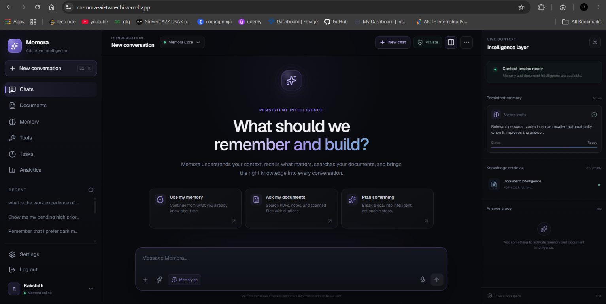
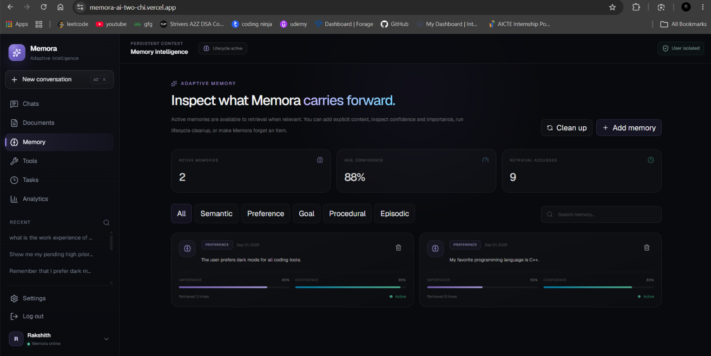
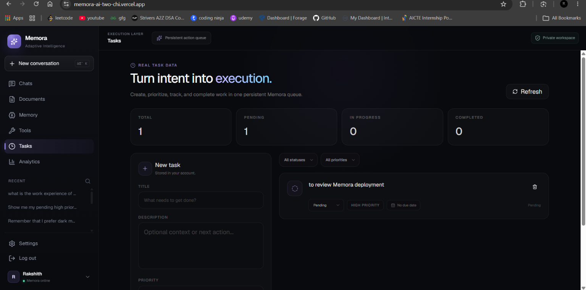
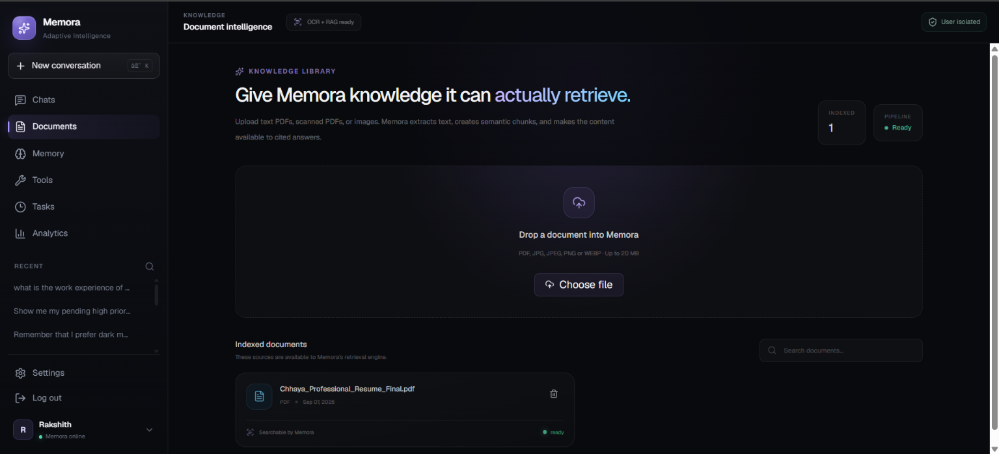

# Memora AI

### Adaptive AI Agent with Persistent Memory and Tool Intelligence

<p align="center">
  <strong>
    A production-deployed AI agent that remembers useful context across conversations,
    reasons over documents, executes tools, manages tasks, and continuously adapts to the user.
  </strong>
</p>

<p align="center">
  <a href="https://memora-ai-two-chi.vercel.app"><strong>Live Demo</strong></a>
  ·
  <a href="https://github.com/Rakshith-028/memora-ai"><strong>GitHub Repository</strong></a>
  ·
  <a href="https://memora-ai-bnzq.onrender.com/health"><strong>API Health</strong></a>
</p>

<p align="center">
  
  
  
  
  
  
  
  
</p>

---

## Overview

Most AI chat applications treat every conversation as a fresh interaction.

**Memora AI is designed around continuity.**

Memora maintains persistent user context across conversations, automatically extracts useful long-term information, retrieves relevant memories semantically, resolves duplicate or conflicting information, reasons over uploaded documents, executes deterministic tools, manages persistent tasks, and exposes these systems through a production-style AI workspace.

The project is built as an **AI agent system**, rather than a thin interface around an LLM API.

### Core Idea

```text
User
  │
  ▼
Next.js Application
  │
  ▼
FastAPI Agent Backend
  │
  ├──► Planner ─────────────► Tool Orchestrator ───► Tools
  │
  ├──► Memory Retrieval ────► pgvector
  │
  ├──► Document Retrieval ──► RAG Pipeline
  │
  └──► LLM Provider ────────► Gemini / Ollama
  │
  ▼
Personalized Response
  │
  ▼
Memory Extraction
  │
  ▼
Validation → Deduplication → Conflict Resolution → Persistence
```

---

## Product Preview

### AI Workspace

<p align="center">
  
</p>

### Persistent Memory

<p align="center">
  
</p>

### Intelligent Tasks

<p align="center">
  
</p>

### Document RAG with Source Citations

<p align="center">
  
</p>

---

## What Makes Memora Different?

Memora does not simply attach previous chat messages to every prompt.

Its memory system determines:

- what information is worth remembering,
- whether a memory is sufficiently grounded,
- whether similar information already exists,
- whether new information updates an older fact,
- which memories are relevant to the current request,
- and which memories should remain active over time.

For example:

```text
Conversation 1

User:
"My favorite programming language is C++."

        ↓

Persistent Memory:

"My favorite programming language is C++."
```

Later, in another conversation:

```text
User:
"What is my favorite programming language?"

        ↓

Semantic Retrieval
        ↓
Relevant Persistent Memory
        ↓

Memora:
"Your favorite programming language is C++."
```

The memory survives beyond the original conversation.

---

# Key Features

## 1. Persistent Adaptive Memory

Memora supports multiple categories of long-term context:

- **Semantic** — persistent facts about the user
- **Preference** — tools, styles, technologies, likes, and dislikes
- **Goal** — longer-term objectives
- **Procedural** — preferred workflows and ways of working
- **Episodic** — relevant past experiences or events

Memories can include metadata such as:

```text
Content
Memory type
Importance
Confidence
Access frequency
Last accessed time
Active / inactive state
Source provenance
Vector embedding
```

Users can inspect and manage persistent memory directly from the application.

---

## 2. Automatic Memory Extraction

Useful personal context can be detected directly from natural conversation.

Example:

```text
User:
"Remember that I prefer dark mode for all my coding tools."
```

Memora can transform this into a canonical persistent memory:

```text
The user prefers dark mode for all coding tools.
```

The extraction pipeline follows:

```text
User Message
    ↓
Extraction Eligibility Check
    ↓
LLM Memory Extraction
    ↓
Grounding Validation
    ↓
Confidence Validation
    ↓
Canonicalization
    ↓
Embedding Generation
    ↓
Lifecycle Resolution
    ↓
Persistent Storage
```

This prevents every user message from automatically becoming permanent memory.

---

## 3. Intelligent Memory Lifecycle

Persistent memory creates problems that ordinary chat history does not solve.

Memora therefore includes a lifecycle layer for duplicate detection, contradiction handling, updates, supersession, and cleanup.

### Duplicate Detection

```text
"The user likes dark mode."

"The user prefers dark themes."
```

These sentences may represent the same underlying preference.

Instead of blindly storing both, the system can identify semantic overlap and resolve redundant memories.

### Contradiction & Update Handling

```text
Old:
"The user's favorite programming language is Python."

New:
"The user's favorite programming language is C++."
```

Both memories describe the same underlying attribute but represent different states.

The lifecycle system can recognize this relationship and allow newer information to supersede outdated information.

### Memory Cleanup

The system can deactivate low-quality, stale, invalid, or redundant memories while preserving useful long-term context.

---

## 4. Hybrid Memory Retrieval

Memory retrieval is not based on vector similarity alone.

Memora can combine signals such as:

```text
Semantic similarity
Lexical relevance
Importance
Confidence
Recency
Access frequency
```

These signals are used to rank stored memories before response generation.

Only relevant context is injected into the agent's working context instead of filling prompts with the entire memory database.

---

## 5. Document Intelligence & RAG

Users can upload documents and ask questions about their contents.

The document pipeline performs:

```text
Document Upload
      ↓
Validation
      ↓
Text Extraction
      ↓
Chunking
      ↓
Embedding Generation
      ↓
pgvector Storage
      ↓
Semantic Retrieval
      ↓
Relevant Context
      ↓
LLM Generation
      ↓
Grounded Answer + Source/Page Reference
```

This allows Memora to answer questions using information retrieved from user documents rather than relying entirely on model knowledge.

The backend also contains OCR support for scanned documents and images.

---

## 6. Agent & Tool Intelligence

Memora includes a planner and tool execution layer.

Instead of expecting the LLM to solve every request directly:

```text
User Request
    ↓
Planner
    ↓
Action Decision
    ↓
Tool Orchestrator
    ↓
Tool Execution
    ↓
Verified Result
    ↓
Final Response
```

Implemented tools include:

| Tool | Purpose |
|---|---|
| Calculator | Deterministic mathematical calculations |
| Date & Time | Date and time operations |
| Document Search | Retrieval over indexed user documents |
| Task Manager | Creation and retrieval of persistent user tasks |

Tool results come from actual runtime operations instead of asking the language model to fabricate an action result.

---

## 7. Intelligent Task Management

Tasks are integrated into the agent itself.

A user can write:

```text
Create a high priority task to review Memora deployment.
```

The request can flow through:

```text
Chat
  ↓
Planner
  ↓
Task Manager Tool
  ↓
PostgreSQL
  ↓
Tasks Workspace
```

The same task can later be queried conversationally:

```text
Show me my pending high priority tasks.
```

This makes task management part of the AI agent rather than an isolated CRUD interface.

---

## 8. Memory-Aware Conversations

For relevant requests, Memora can combine multiple context sources:

```text
Current User Message
        +
Relevant Persistent Memories
        +
Conversation History
        +
Document Evidence
        +
Verified Tool Results
        ↓
Context-Aware Response
```

Current user information can take precedence over outdated stored information, allowing the assistant's understanding to evolve over time.

---

## 9. Memory Workspace

The Memory workspace exposes the long-term context Memora carries between conversations.

Users can inspect information including:

- active memories,
- memory categories,
- confidence,
- importance,
- retrieval access count,
- lifecycle state,
- and stored memory content.

Users can also manage stored memories from the interface.

The goal is to make AI memory **inspectable and controllable**, rather than hidden application state.

---

## 10. Analytics

Memora includes an analytics workspace for observing real application activity.

The dashboard surfaces application-level metrics derived from actual user interactions rather than static placeholder values.

This provides visibility into the behavior and usage of the agent, memories, conversations, documents, and other application systems.

---

# Authentication & User Isolation

Memora is built as a multi-user application.

Authentication features include:

- email/password authentication,
- Google OAuth,
- email verification architecture,
- forgot/reset password flows,
- Argon2 password hashing,
- JWT authentication,
- HttpOnly frontend session cookies,
- Redis-backed authentication rate limiting.

User-owned resources are isolated by authenticated user identity, including:

```text
Conversations
Messages
Memories
Documents
Document Chunks
Tasks
Feedback
Settings
```

---

# Security & Production Hardening

The backend includes production-oriented protections such as:

- environment validation,
- explicit CORS configuration,
- trusted-host validation,
- security headers,
- HSTS in production,
- Redis-backed authentication rate limiting,
- hashed rate-limit identifiers,
- production API documentation restrictions,
- secure secret configuration,
- user-scoped database operations,
- database and Redis health checks.

The production health endpoint verifies:

```text
API
PostgreSQL
Redis
```

---

# AI Provider Abstraction

Memora is designed so local development and cloud deployment do not depend on identical AI infrastructure.

## Local Development

```text
LLM         → Ollama
Model       → Llama 3.2 3B
Embeddings  → sentence-transformers / all-MiniLM-L6-v2
```

## Production

```text
LLM         → Google Gemini
Model       → Gemini 3.5 Flash
Embeddings  → Gemini Embedding
Dimensions  → 384
```

Memory extraction and lifecycle resolution also use the configured LLM provider rather than being hardcoded to a local inference server.

This allows the same agent architecture to operate across local and cloud environments.

---

# System Architecture

```text
┌──────────────────────────────────────────────────────────────┐
│                       Next.js Frontend                       │
│                                                              │
│  Chat │ Memory │ Documents │ Tools │ Tasks │ Analytics      │
│                         Settings                             │
└─────────────────────────────┬────────────────────────────────┘
                              │
                              │ Authenticated API
                              ▼
┌──────────────────────────────────────────────────────────────┐
│                       FastAPI Backend                        │
│                                                              │
│ Auth │ Conversations │ Chat │ Memory │ Documents │ Tasks    │
│ Tools │ Feedback │ Analytics │ Settings                     │
└───────────────┬────────────────────────┬─────────────────────┘
                │                        │
                ▼                        ▼
┌────────────────────────┐    ┌───────────────────────────────┐
│     Agent Runtime      │    │       Retrieval Systems       │
│                        │    │                               │
│ Planner                │    │ Memory Retrieval              │
│ Tool Orchestrator      │    │ Document Search               │
│ LLM Provider           │    │ Hybrid Ranking                │
│ Memory Extractor       │    │ Embedding Service             │
│ Memory Resolver        │    │                               │
└────────────┬───────────┘    └───────────────┬───────────────┘
             │                                │
             ▼                                ▼
┌────────────────────────┐    ┌───────────────────────────────┐
│ Gemini / Ollama        │    │ PostgreSQL + pgvector         │
└────────────────────────┘    └───────────────────────────────┘

                     ┌────────────────────────┐
                     │         Redis          │
                     │ Rate Limiting / Cache  │
                     └────────────────────────┘
```

---

# Technology Stack

## Frontend

- Next.js
- TypeScript
- Tailwind CSS
- Server-side API/BFF routes
- HttpOnly authentication cookies

## Backend

- Python 3.11
- FastAPI
- SQLAlchemy
- Alembic
- Pydantic
- Uvicorn

## Artificial Intelligence

- Google Gemini
- Ollama
- Llama 3.2
- sentence-transformers
- Gemini Embeddings

## Data & Retrieval

- PostgreSQL
- pgvector
- Redis
- Neon
- Upstash Redis

## Document Processing

- PyMuPDF
- pypdf
- Tesseract / pytesseract
- Pillow

## Authentication & Security

- JWT
- Argon2
- Google OAuth
- Redis-backed rate limiting

## Infrastructure

- Vercel
- Render
- Neon
- Upstash
- GitHub Actions
- Docker Compose

---

# Repository Structure

```text
memora-ai/
│
├── backend/
│   ├── alembic/
│   ├── app/
│   │   ├── api/
│   │   ├── core/
│   │   ├── db/
│   │   ├── models/
│   │   ├── schemas/
│   │   ├── services/
│   │   └── tools/
│   ├── tests/
│   ├── requirements.txt
│   └── requirements-prod.txt
│
├── frontend/
│   ├── public/
│   └── src/
│       └── app/
│
├── docs/
│   └── screenshots/
│       ├── dashboard.png
│       ├── memory.png
│       ├── tasks.png
│       └── rag.png
│
├── infra/
├── tests/
│
├── .github/
│   └── workflows/
│       └── ci.yml
│
├── docker-compose.yml
├── .env.example
├── .gitattributes
└── README.md
```

---

# Database & Vector Search

PostgreSQL is the primary persistence layer.

Vector search is implemented using **pgvector**.

The database stores entities including:

```text
Users
Conversations
Messages
Memories
Documents
Document Chunks
Tasks
Feedback
Authentication Tokens
```

Embeddings enable semantic retrieval over both persistent memories and document chunks.

Production persistence is hosted on **Neon PostgreSQL**.

---

# Database Migrations

Schema evolution is managed using Alembic.

The migration history covers:

- core application tables,
- documents and document chunks,
- document duplicate detection,
- feedback,
- tasks,
- production authentication fields.

Production deployments execute database migrations before starting the API server.

---

# CI & Automated Validation

Every push to the main branch runs automated GitHub Actions checks.

The CI pipeline validates:

```text
Backend Tests
Frontend Production Build
```

Current backend test suite:

```text
32 passed
```

Automated tests cover areas including:

- authentication and security utilities,
- production configuration,
- rate limiting,
- API smoke behavior,
- planner behavior,
- agent evaluation scenarios.

---

# Production Deployment

Memora is deployed across independent managed services.

| Layer | Platform |
|---|---|
| Frontend | Vercel |
| Backend API | Render |
| PostgreSQL | Neon |
| Vector Search | pgvector |
| Redis | Upstash |
| LLM | Google Gemini |
| Embeddings | Google Gemini |
| CI/CD Validation | GitHub Actions |

### Live Application

**https://memora-ai-two-chi.vercel.app**

### Backend Health

**https://memora-ai-bnzq.onrender.com/health**

> The backend currently runs on Render's free infrastructure, so the first request after a period of inactivity may experience a cold start.

---

# Production-Verified Flows

Key application flows have been validated end-to-end against the deployed production environment.

## Persistent Memory

```text
Conversation
    ↓
Automatic Memory Extraction
    ↓
Validation
    ↓
Embedding
    ↓
Neon + pgvector Persistence
    ↓
Cross-Conversation Retrieval
    ↓
Personalized Response
```

## Task Agent

```text
Natural-Language Request
    ↓
Planner
    ↓
Task Manager
    ↓
PostgreSQL
    ↓
Tasks Workspace
    ↓
Conversational Retrieval
```

## Document RAG

```text
PDF Upload
    ↓
Processing
    ↓
Chunking
    ↓
Embedding
    ↓
Vector Storage
    ↓
Semantic Retrieval
    ↓
Grounded Answer
    ↓
Source / Page Reference
```

## Google Authentication

```text
Google OAuth
    ↓
Backend Credential Verification
    ↓
Application Session
    ↓
User-Isolated Workspace
```

---

# Local Development

## 1. Clone the Repository

```bash
git clone https://github.com/Rakshith-028/memora-ai.git
cd memora-ai
```

## 2. Start Local Infrastructure

With Docker running:

```bash
docker compose up -d
```

This starts local PostgreSQL/pgvector and Redis services.

---

## 3. Backend Setup

```bash
cd backend
python -m venv .venv
```

### Windows

```powershell
.\.venv\Scripts\Activate.ps1
```

Install dependencies:

```bash
pip install -r requirements.txt
```

Run database migrations:

```bash
alembic upgrade head
```

Start the backend:

```bash
uvicorn app.main:app --reload
```

Local backend:

```text
http://127.0.0.1:8000
```

---

## 4. Local AI Model

Install Ollama and pull the local model:

```bash
ollama pull llama3.2:3b
```

---

## 5. Frontend Setup

Open another terminal:

```bash
cd frontend
npm install
npm run dev
```

Local frontend:

```text
http://localhost:3000
```

---

# Environment Configuration

Use `.env.example` as the starting point for local configuration.

Production secrets must never be committed to the repository.

Typical configuration includes:

```text
DATABASE_URL
REDIS_URL
SECRET_KEY

LLM_PROVIDER
EMBEDDING_PROVIDER

GEMINI_API_KEY
GEMINI_MODEL
GEMINI_EMBEDDING_MODEL
EMBEDDING_DIMENSIONS

GOOGLE_CLIENT_ID

FRONTEND_URL
CORS_ORIGINS
TRUSTED_HOSTS
```

---

# Engineering Decisions

## Why PostgreSQL + pgvector?

Persistent AI memory is relational while also requiring semantic retrieval.

PostgreSQL provides transactional persistence, structured relationships, filtering, and mature database tooling.

pgvector allows semantic embeddings to live alongside the rest of the application's persistent data.

---

## Why Separate Memory Extraction from Retrieval?

These systems solve different problems.

Retrieval answers:

> Which existing memories are relevant right now?

Extraction answers:

> What new information from this interaction deserves to persist?

Keeping these responsibilities separate makes the memory architecture easier to reason about, test, and evolve.

---

## Why Canonicalize Memories?

Different sentences can represent the same underlying user state.

For example:

```text
"I like dark mode."

"I prefer dark themes."
```

Canonicalization reduces redundant memories and improves duplicate and contradiction resolution.

---

## Why a Planner and Tool Orchestrator?

Language models are useful for understanding intent but should not fabricate deterministic operations.

The planner determines what action is appropriate, while tools execute operations against real application state.

This separates **reasoning about an action** from **executing the action**.

---

## Why Hybrid Retrieval?

Semantic similarity alone does not determine whether a memory is useful.

A highly similar memory may be outdated, low-confidence, or unimportant.

Memora therefore incorporates additional retrieval signals such as importance, confidence, recency, lexical relevance, and usage.

---

## Why Provider Abstraction?

Local development should remain inexpensive and independent of cloud inference.

Production, meanwhile, should not depend on a developer's local Ollama server.

The provider layer allows the same agent architecture to operate with local and hosted models.

---

# Design Principles

### Selective Memory Over Unlimited Storage

Not every message deserves to become permanent context.

### Current Truth Over Historical Contradiction

New explicit user information should be able to supersede stale state.

### Retrieval Over Prompt Stuffing

Only context relevant to the current request should reach the model.

### Tools Over Hallucinated Actions

Operations should execute against real systems whenever possible.

### Inspectable Memory Over Invisible Personalization

Users should be able to see and control what the agent carries forward.

### Provider Independence Over Infrastructure Lock-In

The core agent should not depend on one inference environment.

### User Isolation by Design

Persistent personalization must remain scoped to the authenticated user.

---

# Testing

Run the backend test suite:

```bash
cd backend
pytest
```

Current result:

```text
32 passed
```

Build the frontend:

```bash
cd frontend
npm run build
```

These checks are also executed automatically through GitHub Actions.

---

# Project Status

**Production deployed and operational.**

### Core Systems

- [x] Multi-user authentication
- [x] Google OAuth
- [x] Persistent conversations
- [x] Automatic memory extraction
- [x] Semantic memory retrieval
- [x] Hybrid memory ranking
- [x] Memory validation
- [x] Duplicate resolution
- [x] Contradiction handling
- [x] Memory lifecycle cleanup
- [x] User-controlled memory
- [x] Document ingestion
- [x] Vector document retrieval
- [x] Source/page references
- [x] Agent planner
- [x] Tool orchestration
- [x] Calculator tool
- [x] Date/time tool
- [x] Document search tool
- [x] Task manager tool
- [x] Persistent tasks
- [x] Feedback system
- [x] Analytics
- [x] Settings
- [x] Redis-backed rate limiting
- [x] Production security hardening
- [x] Automated backend tests
- [x] Frontend production build validation
- [x] GitHub Actions CI
- [x] Production cloud deployment
- [x] Production memory E2E verification
- [x] Production task E2E verification
- [x] Production document RAG verification

---

# Future Improvements

Potential extensions include:

- streaming agent responses,
- richer observability and tracing,
- refresh-token rotation,
- asynchronous memory consolidation,
- temporal memory reasoning,
- expanded automated agent evaluations,
- additional external tools,
- advanced document collections,
- richer memory provenance visualization,
- dedicated production OCR infrastructure.

---

# Author

**Rakshith**

B.Tech — Artificial Intelligence & Machine Learning

GitHub: [@Rakshith-028](https://github.com/Rakshith-028)

---

<p align="center">
  <strong>Memora AI — AI that carries useful context forward.</strong>
</p>